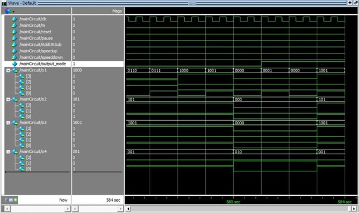
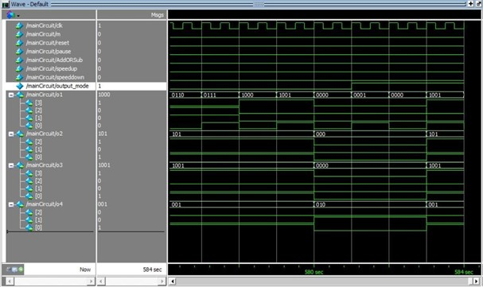
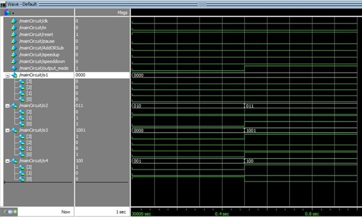
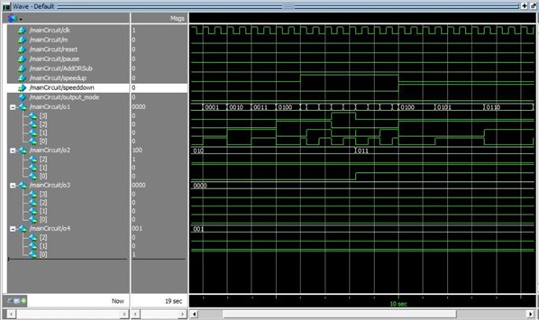
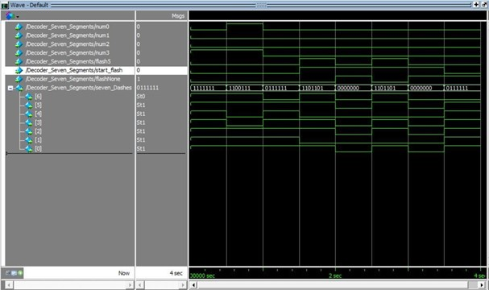
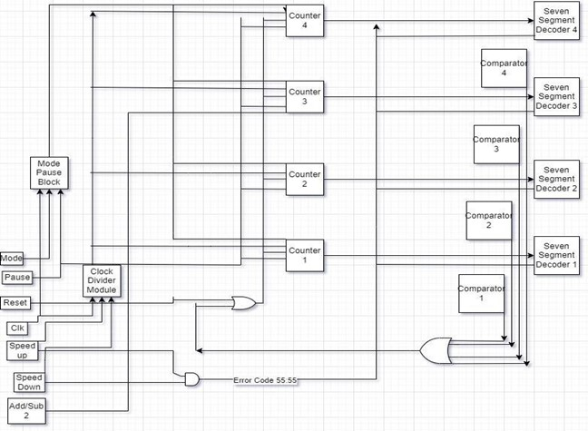
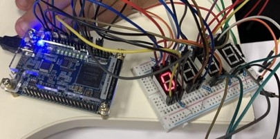

# ⏱️ FPGA Stopwatch – Digital Design & Computer Architecture Project

A feature-rich digital stopwatch implemented in **SystemVerilog**, simulated in **ModelSim**, and designed at the gate/circuit level using **Logisim**.  
The stopwatch supports **up/down counting**, **pause**, **±2 minute jumps**, **speed control (0.5x / 1x / 2x)**, and a **seven-segment display** with an error flashing mode.

---

## 📚 Table of Contents

- [Overview](#overview)
- [Features](#features)
- [Project Parts](#project-parts)
  - [Part 1 – Time Counters](#part-1--time-counters)
  - [Part 2 – Add / Subtract 2 Minutes & Limits](#part-2--add--subtract-2-minutes--limits)
  - [Part 3 – Speed Control & Mode Logic](#part-3--speed-control--mode-logic)
  - [Part 4 – Display System (Seven Segment & Flashing)](#part-4--display-system-seven-segment--flashing)
  - [Part 5 – Main Integrated Circuit](#part-5--main-integrated-circuit)
- [License](#license)

---

## 🔎 Overview

This project implements a **digital stopwatch system** as part of a Digital Design & Computer Architecture course.

The design is built from fundamental digital blocks:

- T flip-flops & D flip-flops  
- 4-bit adders/subtractors and comparators  
- Clock divider & multiplexers  
- Seven-segment decoder  

The stopwatch:

- Counts **up and down** between **10:20** and **49:30**
- Allows **adding or subtracting 2 minutes**
- Supports **pause** and **speed control**
- Displays time on a **four-digit seven-segment display**
- Shows an **error code (55:55)** when both speed controls are activated at once

All behavior is **verified in ModelSim**.

---

## ✨ Features

- ⏫ **Count Up Mode**
  - Counts from **10:20 → 49:30**
  - Cascaded counters for:
    - Seconds units (0–9)
    - Seconds tens (0–5)
    - Minutes units (0–9)
    - Minutes tens (0–4)

- ⏬ **Count Down Mode**
  - Counts from **49:30 → 10:20**
  - Symmetric counters with down-counting behavior

- 🔁 **Automatic Reset at Bounds**
  - When counting **up**, exceeding **49:30** resets to **10:20**
  - When counting **down**, going below **10:20** resets to **49:30**
  - Reset logic is enforced by **comparators** that monitor each digit

- ➕➖ **Add / Subtract 2 Minutes**
  - DIP switch used to select **Add 2** or **Sub 2** (depending on mode)
  - Internally uses a **4-bit adder/subtractor** to add/subtract `2` in binary
  - Properly handles carry/borrow between **minute units** and **minute tens**
    - Example: `19 → 21`, `31 → 29`

- ⏯️ **Pause Functionality**
  - Freezes:
    - Up/down counting  
    - Add/Sub 2 operations  
  - Special pause behavior at minimum and maximum times

- ⚡ **Speed Control**
  - **Speed Up (2×)** – double the clock rate  
  - **Speed Down (0.5×)** – half the clock rate  
  - Implemented using a **clock divider** that outputs:
    - Normal clock
    - Double-speed clock
    - Half-speed clock

- 🚨 **Error Flashing (55:55)**
  - If **Speed Up** and **Speed Down** are enabled simultaneously:
    - Stopwatch enters an **error mode**
    - Time flashes as **55:55**
    - When one control is released, the stopwatch **restores the previous valid time**

- 8️⃣ **Seven-Segment Display**
  - Binary outputs of counters are decoded to drive **four seven-segment digits**
  - Shows minutes and seconds in **MM:SS** format

---

## 🧩 Project Parts

Below are the main logical parts of the project, along with how they work and where their images belong.

### Part 1 – Time Counters

**Modules involved:**

- `Four_Bit_Counter_Seconds`
- `Three_Bit_Counter_Seconds`
- `Four_Bit_Counter_Minutes`
- `Three_Bit_Minutes`

**Main steps:**

1. **Build T-Flip Flop–based counters** for each digit (seconds units/tens, minutes units/tens).
2. **Connect enable signals** so that lower-order counters trigger higher-order ones.
3. Add **mode control (m)** to switch between **up** and **down** counting.
4. Integrate **reset** and **pause** behavior into each counter.
5. Verify the sequence in **ModelSim** waveforms.

📷 **ModelSim count up/down**

### Part 2 – Add / Subtract 2 Minutes & Limits

**Modules involved:**

- `FullAdder`
- `FourBitAdderSubtractor`
- `FourBitComparator`

**Main steps:**

1. Implement a **1-bit full adder**.
2. Use it to build a **4-bit adder/subtractor** that adds or subtracts **2** from the minutes.
3. Connect this logic to the **minute units counter** to handle **±2 minute** jumps.
4. Use **comparators** to ensure the time always stays between **10:20** and **49:30**.
5. On overflow/underflow, trigger **resets** to the boundary times using comparator outputs.

📷 **ModelSim waveforms**

| Modelsim ± 2| Modelsim Reset Up/Down |
| -------------------- | ----------------------- |
|  |  |

### Part 3 – Speed Control & Mode Logic

**Modules involved:**

- `Clock_Divider`
- `Mode_With_Pause`
- `Mux21`
- `Mux42`

**Main steps:**

1. Implement a **clock divider** that generates:
   - Normal clock (1×)
   - Double-speed clock (2×)
   - Half-speed clock (0.5×)
2. Use **multiplexers** to select which clock drives the stopwatch based on the active speed mode.
3. Design the **mode with pause logic** so that:
   - Mode changes (up/down, speed changes) are applied in a controlled way.
   - The stopwatch can be **paused** without losing the current time.
4. Add detection logic for **simultaneous Speed Up & Speed Down** activation:
   - Enter an **error mode** when both are enabled.
   - In error mode, the display shows a flashing **55:55**.
   - When one of the controls is released, the stopwatch **restores the previous valid time** and resumes normal operation.

📷 **Modelsim speed control**

### Part 4 – Display System (Seven Segment & Flashing)

**Modules involved:**

- `Decoder` (binary → seven-segment)
- Flashing / override logic for error display (`55:55`)

**Main steps:**

1. Implement a **binary to seven-segment decoder** that maps digit values `0–9` to segment patterns.
2. Connect the outputs of the **seconds** and **minutes counters** to four seven-segment digits to display time in **MM:SS** format.
3. Add **control logic** to:
   - Select between normal time display and **error display**.
   - Override the counters and show **55:55** when the system enters error mode.
4. Implement **flashing behavior** for the error state:
   - Toggle the display on and off or alternate patterns to make the **55:55** warning clearly visible.
5. Ensure that when error mode ends (only one speed control is active again), the system:
   - **Restores the previously stored valid time**, and  
   - Returns to normal counting and display behavior.

📷 **Modelsim Sevenseg Flash**

### Part 5 – Main Integrated Circuit & FPGA Implementation

This part integrates **all modules** into a single top-level digital system, represented in a **complete schematic diagram** (no Logisim file is attached; the overall design is shown directly in the schematic).

**Main steps:**

1. Connect the following building blocks in one schematic:
   - Time counters for **minutes** and **seconds**
   - **Add/Sub 2 minutes** unit
   - **Comparators** enforcing the 10:20 ↔ 49:30 limits
   - **Clock divider** and **speed control logic**
   - **Pause / mode control** (mode/pause block)
   - **Seven-segment decoders** and display logic (including the `55:55` error code)
2. Route **inputs** (mode, pause, reset, clock, speed up/down, add/sub 2) to control:
   - Count mode (**up / down**)
   - **Pause / resume**
   - **Add/Sub 2 minutes**
   - **Speed Up** and **Speed Down** modes
3. Ensure a **single, clean clock domain** drives all synchronous modules to avoid glitches or timing issues.
4. Implement and test the design on an **FPGA development board**:
   - Connect the stopwatch outputs to **external seven-segment displays** on a breadboard.
   - Verify that the **real hardware behavior** (up/down counting, ±2 minutes, pause, speed control, and error code `55:55`) matches the **ModelSim simulations**.

📷 **Schematic & FPGA implementation:**
1. **Circuit Schematic**
   
  
2. **FPGA Implementation**
   
   
## ⚖️ License

⚠️ **Important Notice:** This repository is publicly available for viewing only.  
Forking, cloning, or redistributing this project is **NOT** permitted without explicit permission.

Copyright (c) 2022 Contributers  
- Youssef Alaa  
- Ahmed Samy
- Kareem Magdy
- Rehab Yehia

